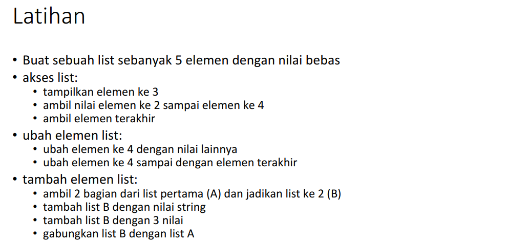
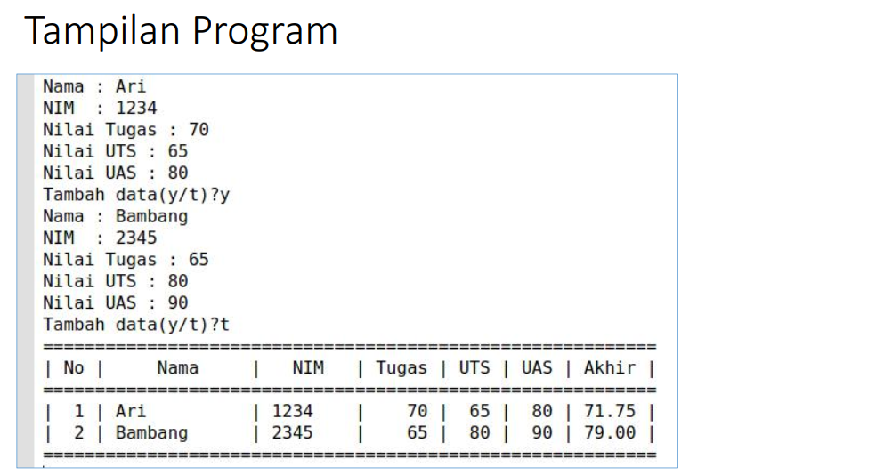
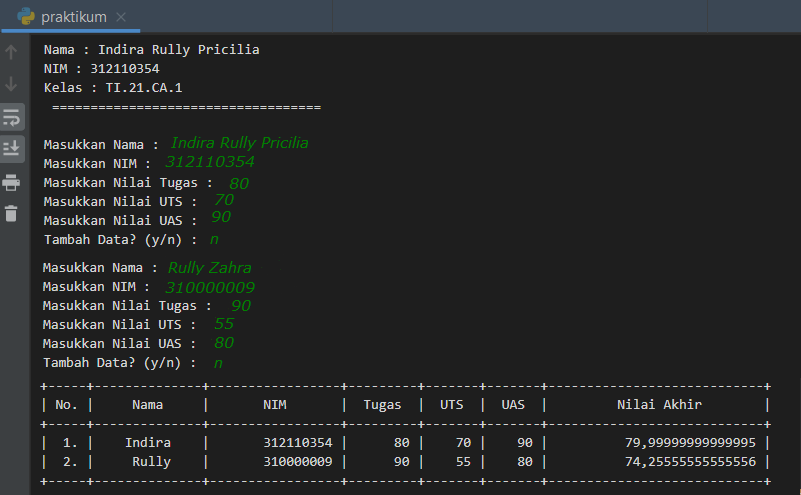

# List1

## Tugas Pertemuan 9 - Praktikum(Bahasa Pemrograman)

= Nama : Indira Rully Pricilia
= NIM : 312110354
= Kelas : TI.21.CA.1

Pada mata kuliah Bahasa Pemrograman - Pertemuan 9 kali ini saya mendapatkan materi List, Tuple dan Dictionary. Nah, untuk praktikum ini materi yang didapatkan adalah List.

Didalam materi praktikum ini terdapat 2 tugas. Yaitu : Latihan dan Praktikum.

Berikut adalah tugas dari Latihan, bisa dilihat pada gambar dibawah ini :

### Latihan
Berikut jawaban / source code / program sederhana yang telah saya buat :

print("Nama : Indira Rully Pricilia")
print("NIM : 312110354")
print("Kelas : TI.21.CA.1")
print("===========================")
print("Latihan - Modul Praktikum") 
print()

print("Membuat List dengan 5 elemen")
daftar = [1, 2, 3, 4, 5]
print(daftar)
- Akses List
print("Menampilkan elemen ke 3")
print(daftar[2])

print("Ambil nilai elemen ke 2 sampai ke 4")
print(daftar[1:4])

print("Ambil nilai terakhir")
print(daftar[-1])

- Ubah element list
print("ubah elemen ke 4 dengan nilai lainnya")
daftar[3] = 8
print(daftar[3])

print("ubah elemen ke 4 sampai dengan elemen terakhir")
daftar[3:5] = [16, 20]
print(daftar)

- Tambah Element List
print("ambil 2 bagian dari list pertama(A) dan jadikan list ke2(B)")
baris = daftar[3:5]
print(baris)

print("tambah list B dengan nilai string")
baris.append ("Indira")
print(baris)

print("Tambah list B dengan 3 nilai")
baris.append(["Rully", 3, 2])
print(baris)

print("Menggabungkan list A dengan List B")
gabung = daftar + baris
print(gabung)

Untuk hasil dari source code tersebut adalah seperti berikut :

 
Nah seperti itulah hasil dari program Latihan yang diberikan oleh dosen.

### Praktikum

Untuk tugas yang kedua yaitu Tugas Praktikum, yaitu tugas untuk membuat program sederhana menampilkan Data Nilai Mahasiswa.

Berikut soal yang diberikan oleh dosen :

Hasil yang di harapkan oleh dosen adalah seperti berikut :

• Pada akhirnya saya bisa membuat program yang diberikan oleh dosen. Berikut source code yang telah saya temukan untuk membuat program sederhana Data Nilai Mahasiswa :

from prettytable import PrettyTable

print("Nama : Indira Rully Pricilia")
print("NIM : 312110354")
print("Kelas : TI.21.CA.1")
print("===========================")
print("Praktikum - Modul Praktikum")
print()

daftar = []
stop = False

# Mengisi Nilai
while not stop:
     nama = input("Masukkan Nama : ")
     nim = input("Masukkan NIM : ")
     tugas = input("Masukkan Nilai Tugas : ")
     uts = input("Masukkan Nilai UTS : ")
     uas = input("Masukkan Nilai UAS : ")
     nilai_akhir = 0.3 * float(tugas) + 0.35 * float(uts) + 0.35 * float(uas)
     daftar.append([nama, nim, tugas, uts, uas, nilai_akhir])
         
     tanya = input("Tambah data? (y/n) : ")
     if tanya == "n":
        stop = True

# Cetak semua nilai
print("==============================")
print()

x = PrettyTable()
i = 0

for data in daftar:
     i += 1
     x.field_names = ["No", "Nama", "NIM", "Tugas", "UTS", "UAS", "Nilai Akhir"]
     x.add_row([i, data[0], data[1], data[2], data[3], data[4], data[5]])
print(x)

• Didalam source code atau soal tersebut menunjukkan bahwa system harus menampilkan data sebanyak-banyaknya jika user menginputkan Y pada pilihan Tambah Data? . Sedangkan hasilnya juga harus sama, menampilkan data sebanyak yang user inputkan. Dan harus terbentuk dalam Table.

Berikut hasil yang saya dapatkan ketika saya menginputkan 1 data mahasiswa :

Berikut hasil yang saya dapatkan ketika saya menginputkan 2 atau lebih Data Nilai Mahasiswa :

Saya akan menjelaskan secara singkat tentang source code tersebut.

Saya menggunakan fungsi While untuk mengantur kondisi, seperti While not stop, jadi jika tidak berhenti maka system akan terus menampilkan perintah user untuk menginputkan data mahasiswa
Penjelasan tersebut atau bisa digunakan ketika kita mengetikan huruf n pada peritah : Tambah Data? (y/n)
Untuk perhitungan nilai akhir sesuai dengan ketentuan yang dosen inginkan, yatu 30% dari Nilai Tugas, 35% dari Nilai UTS, dan 35% dari Nilai UAS
Sedangkan untuk menampilkan hasil dari inputan user tersebut saya menggunakan fungsi atau modul dari PrettyTable(),

Untuk menggunakan module dari Pretty Table, saya harus melakukan beberapa persyaratan yang harus di install. Yaitu : PIP, PrettyTable dan Numpy.

Berikut flowchart tsb.

Mungkin sekian yang dapat saya jelaskan, terimakasih atas perhatiannya..

Indira Rully Pricilia - 312110354 - TI.21.CA.1 
